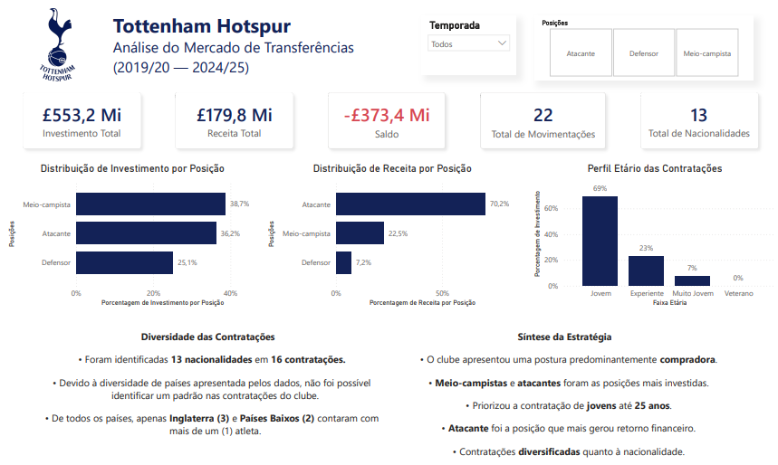

# Tottenham Hotspur — Análise do Mercado de Transferências (2019/20 - 2024/25)

  

<h2 align="center">Análise do Mercado de Transferências</h2>

 <strong>2019/20 — 2024/25</strong> 

 Análise financeira e estratégica das movimentações do Tottenham Hotspur utilizando Excel, Power Query, Power BI e DAX. 

     

 ## 📊 Dashboard

 
  

 Dashboard desenvolvido no Power BI para consolidar os principais indicadores financeiros, padrões de contratação e características da estratégia de mercado do Tottenham Hotspur. 

## 🎯 Sobre o projeto

Este projeto analisa as movimentações do Tottenham Hotspur no mercado de transferências entre as temporadas 2019/20 e 2024/25. 

O objetivo foi transformar dados de contratações e saídas de jogadores em informações capazes de responder perguntas relacionadas à estratégia financeira e esportiva do clube no mercado de transferências. 

A análise passou pelas etapas de: 

Tratamento → Análise exploratória → Modelagem → DAX → Visualização → Insights

## ❓ Perguntas de negócio 

A análise foi estruturada a partir de seis perguntas principais: 

1. O Tottenham apresentou lucro ou prejuízo no mercado de transferências ao longo das temporadas analisadas?
2. Quais posições receberam maior volume de investimento?
3. O clube priorizou a contratação de jogadores jovens ou mais experientes?
4. Quais posições geraram maior retorno financeiro ao clube?
5. Existe um padrão de nacionalidades nas contratações realizadas pelo Tottenham Hotspur?
6. Quais características definiram a estratégia do Tottenham Hotspur no mercado de transferências entre 2019/20 e 2024/25?
